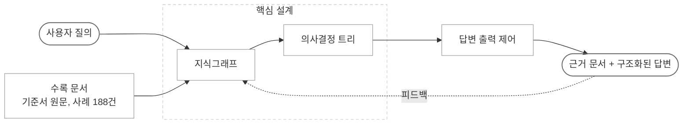
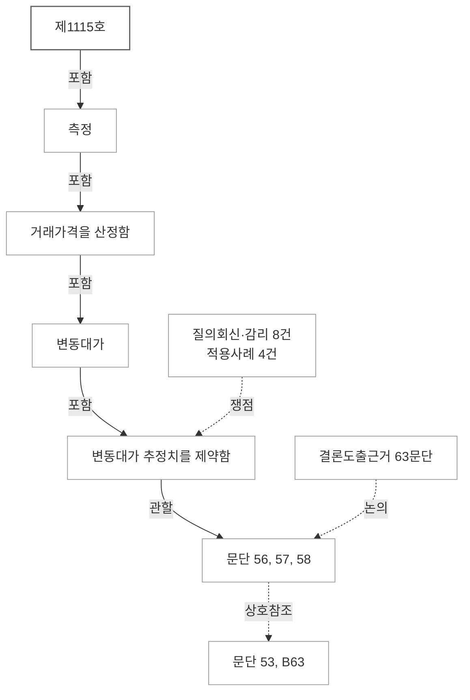
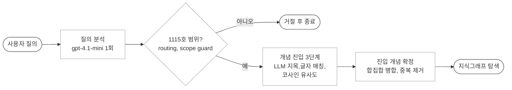
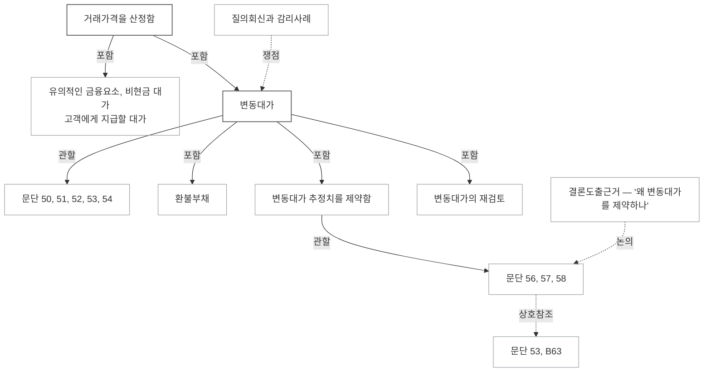

# K-IFRS 1115호 챗봇

> **라이브 데모 배포 → http://134.185.104.224:8501/** (Oracle Cloud 배포, Streamlit)

---

## 개요

### 1. 프로젝트 소개

K-IFRS 제1115호(고객과의 계약에서 생기는 수익) 질의응답을 위한 AI 챗봇



- 수록 문서 ([전체 목록](#데이터-구성))
  - 기준서 원문 : 규정 247문단, 결론도출근거(BC) 652문단
  - 사례 188건 : 질의회신 101건, 감리지적사례 22건, 적용사례(IE) 65건
- 핵심 설계
  - 지식그래프 : 기준서의 목차 위계와 문단 간 상호참조 관계를 노드와 간선으로 구조화(개념 80개, 문단 247개, 사례 188개)
  - 의사결정 트리 : 기준서 원문의 조건부 판단 기준을 41개의 의사결정 트리 형태로 재구성
- 답변 출력 제어
  - 형식 통제 : PydanticAI를 활용하여 결론, 인용 문단, 참조 사례(사례 없을 경우 빈칸)를 필수 답변 형식으로 지정 (결론, 인용문단 누락 시 재생성)
  - 교차 검증 : 생성된 답변과 판단 근거(조문/사례)를 함께 제공하여 직접 원문 확인 가능 
  - 조건부 답변 : 질의의 사실관계가 불충분한 경우, Case별 결론과 추가 확인 질문 제시
- 피드백
  - 사용 기록 저장 : 질의 원문, 진입 개념, 지식 그래프 순회, 인용 문단, 생성 답변 저장 → 실패 지점 추적
  - 기계적 판정 지표 : 진입/문단 실패 점검, 용어사전 보강 필요성 판정
  - 사용자 행동 신호 수집 : 부정 피드백과 사유, 동일 세션 내 연속 재질문 수집

### 2. 문제 인식 및 기준서 선정

#### 범용 LLM 및 유사도 기반 검색의 한계

- **범용 LLM**
  - 답변 검증의 어려움 : 기준서 근거 조문 및 관련 사례 추적 불가
  - 환각 답변 생성 위험 : 기준서에 명시되지 않은 판단을 통해 답변할 위험 
  - 2종 오류 발생 위험 : 틀린 답변을 사실처럼 출력할 위험
- **단순 유사도 기반 검색 RAG**
  - 의미 유사도 한계 : 점수 폭이 좁아 관련 조문과 무관 조문간 구별이 어려움
    ```
      질의 "수익을 기간에 걸쳐 인식하나, 한 시점에 인식하나"
        문단 35 (정답, 기간에 걸쳐)  0.44
        문단 38 (정답, 한 시점)      0.35
        문단 70 (무관, 리베이트)     0.32   ← 문단 38과 0.03 차이
    ```
  - 상호참조 추적 불가 : "문단 B63을 적용한다" 같은 안내 문장 자체를 회수하지만, 실제 B63문단 내용은 회수 하지 못함
  - 문서 위계 구조 소실 : 청킹 과정에서 기준서 목차 위계와 본문–부록 관계 끊김
  - 개선 수단 부재 : 임계값, 가중치 조정 등의 근거가 없음

#### K-IFRS 제1115호 선정 배경

- **질의회신 및 감리지적사례 최다 발생**
  - 한국회계기준원 질의회신 및 금감원 감리지적사례 데이터 전수 분석
  - 총 123건(질의회신 101건, 감리지적사례 22건)으로 전체 기준서 중 가장 많음
- **알고리즘 구현을 위한 논리 구조의 적합성**
  - 조건부 판단 기준이 주제별로 서술(5단계 수익인식 모형, 반품권 등)
  - 기준서의 분기 구조를 바탕으로 총 41개의 의사결정 트리를 도출
- **개인적 동기**
  - 수험 과정 중 수익 인식 파트의 사례 판단 유형에서 어려움을 겪음
  - 복잡한 거래의 본질이 기준서의 어떤 조문에 근거하는지 추적하고 검증할 수 있는 보조 도구의 필요성을 체감

### 3. 핵심 설계

#### 3-1. 지식그래프 기반 데이터 구조화


**기준서 본문 및 사례 구조화** (자세한 설명 : [3-2. RAG — 지식그래프](#3-2-기술-설명--rag--지식그래프))
- 기준서 목차를 80개의 핵심 개념으로 구조화 (최상위 1, 중간 분류 20, 말단 개념 59)
- 노드 : 개념 80, 기준서 문단 247, 사례 188(질의회신 101, 감리지적 22, 적용사례 65)
- 간선 : 포함 79(개념→하위 개념), 관할 247(개념→문단), 상호참조 644(문단→문단), 쟁점 244(사례→개념), 인용 1,220(사례→문단, 근거 표시 전용)
- 기준서 원문에 규정된 연결 구조 활용 → **범용 LLM 및 유사도 기반 검색의 한계를 보완**

#### 3-2. 시스템 파이프라인 

```
   사용자 질의
       │
 ━━━ 1. Retrieval 진입 ━━━
       │
       ├─ 진입 : 사용자 질의에서 진입 개념 찾기 (3단계 합집합)
       │    ├─ 1. LLM 지목       용어사전에서 질의에 해당하는 개념 선택
       │    ├─ 2. 글자 매칭       질의에 사용된 용어를 통해 개념 선택
       │    └─ 3. 코사인 유사도   질의와 가장 가까운 개념 3개
       │
       ├─ 순회 : 진입된 개념 간선을 따라 근거 수집
       │    ├─ 진입된 개념 → 문단 → 이웃 문단
       │    ├─ 진입된 개념 → 쟁점 질의회신, 감리사례, 적용사례
       │    └─ 수집된 문단 → 제정 취지(BC)
       │
       ▼
 ━━━ 2. 의사결정 트리 활용 ━━━
       │
       ├─ 기준서 원문의 조건부 판단 분기 준수
       └─ LLM 자의적 추론 통제
       │
       ▼
 ━━━ 3. PydanticAI 기반 출력 제어 ━━━
       │
       ├─ 필수 조문 인용 및 형식 검증
       └─ 조건 미달 시 반려 및 재생성
        │
        ▼
   근거 문서 + 구조화된 답변
        │
 ━━━ 4. 피드백 ━━━
       │
       ├─ 사용 기록 저장 : 진입 개념, 지식 그래프 순회, 인용 문단 등
       ├─ 기계적 판정 지표 : 검색과 인용 이상 점검, 용어사전 보강 후보 선정
       └─ 사용자 행동 신호 수집 : 부정 피드백, 연속 재질문 수집
```
1. **Retrieval 진입**
   - 각 단계 지목 개념 → 합집합 병합
   - **1단계** : [용어사전](#용어-사전-구축-방식)을 질의원문과 함께 LLM에게 제시 → 질의에 해당하는 개념 선택
     ```
     질의  "판매장려금을 매출에서 빼야 하나?"
              │
              │ 용어사전 활용 : 판매장려금 → 리베이트 
              ▼  
          리베이트  →  고객에게 지급할 대가  →  문단 70, 71, 72
     ```
   - **2단계** : 사용자 질의 원문에 사용된 용어를 통해 개념 지목
   - **3단계** : 질의 원문 ↔ 개념 80개, 코사인 유사도 상위 3개 지목
2. **의사결정 트리를 활용하여 자의적 추론 통제**
   - 기준서 원문에 규정된 조건부 판단 로직을 41개의 의사결정 트리로 추출
   - 실제 판단 절차를 따르므로 LLM의 자의적 추론을 통제
3. **PydanticAI 기반 출력 제어**
   - 출력에 명확한 조문 인용이 없거나 판단 분기를 거치지 않은 답변 반려
   - 최종 출력물을 고정된 형식으로 반환하도록 강제 → 시스템 답변의 일관성과 가독성 확보
4. **피드백을 통한 보강**
   - 사용 기록 저장 → 전 과정을 단계별 기록하여 실패 지점 추적
   - 기계적 판정 지표 → 진입/문단 이상 판단 및 용어사전의 보강 필요성 판정
   - 사용자 행동 신호 수집 → 정답이 없는 실제 질의를 사용자의 행동으로 보완

### 4. 주요 성능 평가 결과

실제 한국회계기준원 질의회신 90건, 정답 문단 164문단으로 구성된 테스트 셋을 활용하여 성능을 검증

| 평가 지표                | 1회차             | 2회차             | 3회차             |
| ------------------------ | ----------------- | ----------------- | ----------------- |
| **결론 재현**            | **95.6%** (86/90건) | **93.3%** (84/90건) | **93.3%** (84/90건) |
| 정답 문단 회수         | 92.1% (151/164문단)   | 90.9% (149/164문단)   | 92.1% (151/164문단)   |
| 질의회신 문서 유입(순환) | 0% (0/90건)         | 0% (0/90건)         | 0% (0/90건)         |
| 실행 에러                | 0% (0/90건)         | 0% (0/90건)         | 0% (0/90건)         |

3회 모두 실패(3건), 회차별 판정 불일치(5건) 분석은 [결론 미재현 원인 분석](#결론-미재현-원인-분석)에 기술<br>
정답지 생성 방식과 격리 방법은 [테스트셋 생성 원칙](#테스트셋-생성-원칙)에 기술

### 5. 실제 사용 스크린샷 

> **사용자 질문 —** A가 B에게 재화를 100원에 공급하고 세금계산서를 발행, B가 고객 C에게 120원에 판매할 때, A의 매출액은 100원이야 120원이야?

<p align="center">
  
</p>
<p align="center"><sub>좌측은 기준서 근거 문서, 우측은 AI 판단 - 조건에 따라 Case 1, 2, 3으로 분기하고 각 분기에 문단 인용</sub></p>

---

## 목차

1. [문제 인식 및 데이터 구성](#1-문제-인식-및-데이터-구성)
2. [실증 예시](#2-실증-예시)
3. 기술 설명
   1. [진입점](#3-1-기술-설명--진입점--다단계-개념-진입)
   2. [RAG — 지식그래프](#3-2-기술-설명--rag--지식그래프)
   3. [의사결정 트리](#3-3-기술-설명--의사결정-트리)
   4. [PydanticAI](#3-4-기술-설명--pydanticai)
   5. [피드백](#3-5-기술-설명--피드백)
4. [검증](#4-검증)
5. [핵심 의사결정](#5-핵심-의사결정--거리-기반-rag에서-지식그래프로의-전환)
6. [한계](#6-한계)

---

## 1. 문제 인식 및 데이터 구성

### 범용 LLM 대비 본 프로젝트의 차별점

| 구분      | 범용 LLM                              | 본 시스템                                              |
| --------- | ------------------------------------- | ------------------------------------------------------ |
| 근거 추적 | 블랙박스 형태(조문 추적 어려움)       | 지식 그래프 기반 개념→문단→사례 추적 근거 제시         |
| 재현성    | 동일한 질문에 매번 다른 답            | 진입/생성 LLM 변동은 잔존, 그래프 순회는 LLM 개입 없음 |
| 판단 출처 | 기준서에 없는 판단을 지어낼 위험      | 사전 정의된 의사결정 트리로 추론 절차 통제             |
| 환각 위험 | 그럴듯한 오답 생성(**2종 오류 위험**) | 근거 부족이라고 명확히 응답                            |

### 회계감사의 핵심 리스크: 2종 오류

| 오류     | 정의                             | 위험도                          |
| -------- | -------------------------------- | ------------------------------- |
| 1종 오류 | 근거가 존재하지만 찾지 못함      | 낮음 — 추가 검색으로 보완가능   |
| 2종 오류 | 근거가 없는 내용을 사실처럼 답변 | **치명적** — 큰 비용으로 이어짐 |

본 파이프라인은 2종 오류의 최소화에 초점을 맞춤

- 기준서 기반 : 기준서에 명시된 확실한 조건에서만 결론을 도출
- 통제된 답변 : 근거 없는 확정적 답변 생성을 구조적으로 차단
- 유보적 접근 : 내용이 모호하거나 교차 검증이 필요한 경우 조문만 제시하고 최종 판단을 유보

### 데이터 구성

| 문서 구분                | 범위                          |    수량 | 소제목 |
| ------------------------ | ----------------------------- | ------: | -----: |
| 목적                     | 1~4                           |   4문단 |      2 |
| 적용                     | 한4.1                         |   1문단 |      1 |
| 적용범위                 | 5~8                           |   4문단 |      1 |
| 인식                     | 9~45                          |  37문단 |     13 |
| 측정                     | 46~90                         |  45문단 |     14 |
| 계약원가                 | 91~104                        |  14문단 |      4 |
| 표시                     | 105~109                       |   5문단 |      1 |
| 공시                     | 110~한129.5                   |  25문단 |     12 |
| 부록 A 용어의 정의       | —                             |   1문단 |      1 |
| 부록 B 적용지침          | B2~B89                        |  95문단 |     25 |
| 부록 C 시행일과 경과규정 | C1~C10                        |  16문단 |      5 |
| 기준서 규정 소계         | 본문 1\~129, B2\~B89, C1\~C10 | 247문단 |     79 |
| 결론도출근거(BC)         | BC1~BC510                     | 652문단 | 21그룹 |
| 적용사례(IE)             | 사례 1~63(46A, 48A 포함)      |    65건 |      — |
| 실무 사례                | 질의회신 101, 감리지적사례 22 |   123건 |      — |

> 목차·머리말 문단 3개(`B1`, 부록 B 머리말, 부록 C 머리말) 제외

---

## 2. 실증 예시

**질문**(QNA-2017-I-KAQ015-Q1) : 아파트 분양계약으로 고객이 1차 중도금 납부 전엔 해제 가능(위약금 분양대금의 10%), 이후엔 해제불가. 이때 회사가 수행완료분에 대한 집행 가능한 지급청구권을 가져 진행기준을 적용할 수 있는가?

1. **질의 분석 및 개념 진입** (gpt-4.1-mini)
   - 게이트 : 질의가 수익인식 기준(1115호) 범위인지 판별 (→ IN)
   - 라우팅 : 금액 계산인지 회계 추론인지 분류 (→ 회계 추론)
   - 3단계 개념 진입 → 개념 7개 확정
     - 1단계 LLM 지목 : 계약을 식별함, 계약체결 증분원가
     - 2단계 글자 매칭 : 지급청구권, 변동대가, 변동대가 추정치를 제약함, 대체 용도가 있는 자산을 만들지 않는다(문단 35⑶)
     - 3단계 코사인 : 기간에 걸쳐 이행하는 수행의무
2. **지식그래프 확장**
   -  개념 7개의 관할 문단 → 상호참조 이웃 문단 → 쟁점 사례 순으로 수집
   -  기준서 문단 35개, 사례 40개, 적용사례 15개
3. **의사결정 트리 활용**
   - 진입 개념에 걸린 트리를 전부 주입 (트리 5개, 2,521자)
     - 기간에 걸쳐 vs 한 시점 인식 ← 기간에 걸쳐 이행하는 수행의무, 지급청구권,대체 용도가 있는 자산을 만들지 않는다(35⑶)
     - 계약의 식별(5요건) ← 계약을 식별함
     - 변동대가(추정) ← 변동대가
     - 변동대가 제약 ← 변동대가 추정치를 제약함
     - 계약체결 증분원가 ← 계약체결 증분원가
   - 트리가 요구하는 분기(위약금이 "원가 + 적정이윤"에 해당하는가)가 질의문에 없어 확인 질문형태로 답변
     - Case 1 — 위약금 10%가 수행 완료분 보상에 미달 → **한 시점**에 인식 (문단 38)
     - Case 2 — 충분히 보상하여 지급청구권 요건 충족 → **기간에 걸쳐** 인식 (문단 35)
   - 인용 문단 35, 37, 38, B9, B11, IE79, IE87 (정답 문단 37, B9, B11, B12 → 4개 중 3개 회수)
4. **PydanticAI 기반 출력 제어**
   - 필수 조문 인용 검증 : 인용이 없으면 재생성을 요구(2회 초과 재생성 실패 시 답변 실패로 산출)
   - 판단 분기 라벨을 필드로 강제 : 답을 산문으로 뽑지 않고 구조적으로 반환
   - 환각 필터 : 실제 컨텍스트에 있던 키만 통과, 없는 사례번호는 걸러짐

---

## 3-1. 기술 설명 : 진입점 — 다단계 개념 진입

> **실제 구현** — [`analyze.py`](app/nodes/analyze.py), [`graph.py`](app/domain/graph.py)



### 질의 분석 계층 

| 추출 필드           | 판정 기준                             | 목적                                         |
| ------------------- | ------------------------------------- | -------------------------------------------- |
| `routing`           | 1115호 IN / OUT                       | OUT이면 파이프라인 종료                      |
| scope guard         | 질의 내 1115호 핵심 단어 부재         | routing=IN이어도 다시 OUT(오분류 방어)       |
| `needs_calculation` | 계산 / 회계추론                       | 생성 모델 분류 — gpt-4.1-mini / Gemini Flash |
| `is_situation`      | 복합 쟁점 / 단순 조문 검색            | clarify(꼬리질문) 분기 / 단순 조문 안내      |
| `confusion_point`   | 질의에 포함된 사용자 오해의 원인 식별 | clarify 프롬프트에 주입해 오해 교정          |
| `provided_info`     | 질문에 이미 포함된 판단요소           | 재질문 방지                                  |
| `standalone_query`  | 회사명 제거, 1115호 공식용어로 번역   | 글자 매칭·코사인 입력                        |

### 개념 진입 3단계

| 단계      | 개념 탐색 방법                              | 세부사항                                           |
| --------- | ------------------------------------------- | -------------------------------------------------- |
| **1단계** | 질의 원문 + 용어사전 → LLM이 해당 개념 지목 | 예: 판매 장려금 → 리베이트                         |
| **2단계** | 질의 원문 용어에 해당하는 개념 지목         | LLM 개입 없음                                      |
| **3단계** | 코사인 유사도 상위 3개 지목                 | k값 증가 시 회수량 대비 주입량 비효율적 급증 → k=3으로 최적화 |

### 각 단계 기여도 검증
각 단계 제거 시 소실되는 [정답 문단](#4-검증) 실측
| 제거 단계        | 소실 정답 문단 (3회 실측) |
| ---------------- | ------------------------- |
| 1단계 LLM 지목   | −7 / −12 / −8             |
| 2단계 글자 매칭  | −4 / −4 / −3              |
| 3단계 코사인| −28 / −20 / −18       |

### 용어 사전 구축 방식

1. 초안 생성 (GPT o4-mini)
   - GPT(o4-mini)로 자주 쓰이는 말(판매장려금, 리베이트, 풋옵션…)을 1115호 공식용어 2~4개에 매핑
   - 수익인식,거래가격와 같은 범용어에는 매핑되지 않도록 규칙 → 사전 초안 288개
2. 사전 확장
   - 어휘 수집
     - 초안 288개 + 사례 제목(질의회신과 감리지적사례) + 부록A
   - 개념 연결
     - 각 단어를 그래프 개념에 연결
     - 애매한 단어 78개 → 본문을 보고 수동연결
   - 사각지대 보완
     - 단어와 개념이 전수로 연결되는지 확인
     - 연결이 부실한 단어 → 본문을 근거로 보완
     
---

## 3-2. 기술 설명 : RAG — 지식그래프

기준서의 위계 관계를 노드와 간선으로 옮긴 지식그래프

> **실제 구현**
> - 탐색 코드 : [`graph.py`](app/domain/graph.py) — [`resolve_question`](app/domain/graph.py#L274), [`traverse`](app/domain/graph.py#L351)
> - 빌드 스크립트 : [`14~21-ontology-*.py`](app/preprocessing)
> - 산출 데이터 : [`data/ontology/`](data/ontology)


### 노드 정의

| 구분 | 구성 요소     | 규모 및 특징                                                |
| ---- | ------------- | ----------------------------------------------------------- |
| 본체 | 개념 노드     | 80개 (하위문단 없는 중간 계층 노드 4개 포함)                |
| 본체 | 관할 문단     | 247개 (개념 노드 종속 문단)                                 |
| 본체 | 사례          | 총 188개 (질의회신 101건, 감리사례 22건, 적용사례(IE) 65건) |
| 본체 | 결론도출근거  | 652문단 (21개 그룹)                                         |
|      | **소계**      | **1,167개**                                                 |
| 입구 | 용어          | 349개 (질의 원문에서 시작 개념 진입)                        |
| 출구 | 의사결정 트리 | 41개 (개념과 연결된 트리 → LLM주입)                         |
|      | **합계**      | **1,557개**                                                 |

### 관계(엣지) 정의

| 구분 | 연결 노드    | 관계 유형(Edge) |      개수 | 세부 의미                                                     |
| ---- | ------------ | --------------- | --------: | ------------------------------------------------------------- |
| 순회 | 개념 → 문단  | 관할            |       247 | 개념이 규정하는 문단                                          |
| 순회 | 문단 ↔ 문단  | 상호참조        |       644 | 타 문단 인용("제N문단 참조")                                  |
| 순회 | 사례 → 개념  | 쟁점            |       244 | 사례가 다투는 논점 (질의회신·감리 179개, 적용사례 65개)           |
| 순회 | 사례 → 개념  | 직결            |         9 | 인용 조문이 없는 사례를 개념에 직접 매핑                      |
| 순회 | BC → 문단    | 논의            |     4,861 | 목차 표기로 이은 BC→본문                                    |
| 순회 | BC → 문단    | 언급            |       327 | BC 본문이 "문단 N"을 인용                                     |
| 순회 | BC → 개념    | 배경            |       516 | 제정 취지                                                     |
| 경계 | 용어 → 개념  | 진입            |       672 | 질의에서 개념으로 진입 (입구)                                 |
| 경계 | 개념 → 트리  | 트리거          |        46 | 개념과 연관된 의사결정 트리 (출구)                            |
| 보존 | 사례 → 문단  | 인용            |     1,220 | 사례가 참고한 문단 — 근거 표시와 쟁점 판정 범위 한정에만 사용 |
| 보존 | 개념 ↔ 개념  | 계층            |        79 | 상위와 하위 주제 간 종속 관계                                 |
| 보존 | 개념 ↔ 개념  | 5단계 순서      |         7 | 수익인식 5단계 모형 선후 흐름                                 |
| 보존 | 문단 ↔ 부록B | 대응            |         3 | 본문과 부록(적용지침) 간 연계                                 |
|      | **합계**     |                 | **8,875** |                                                               |

### 구축 방법

각 문서가 제공하는 정보의 성격이 상이함 → 각 문서별 다른 연결 방식 적용

1. **기준서 본문 : 기준서 명시 구조 유지**
   - 개념 계층 → 목차 위계, 문단 연결 → 원문 내용 그대로
   - 단순 문단 범위 나열(예: B1 등 3개 문단) 연결 제외
2. **결론도출근거(BC) : 결론 참고용 근거로만 사용**
   - 방대한 분량(글자 수 기준 5배) → 질의 1건당 평균 232문단이 검색되는 비효율
   - 답변 생성을 위한 핵심 내용이 아니므로 생성 과정 배제
   - 근거 패널에 제한적으로 노출
3. **적용사례(IE) : 기준서 명시 구조 유지**
   - 기준서 IE 목차에 정의된 각 사례와 주제 간의 매칭 관계 그대로
4. **질의회신·감리지적사례 : '인용', '쟁점' 간선 분리**
   - **인용 (1,220개)** : 사례 본문이 근거로 제시한 문단
     - 화면 근거 표시 및 쟁점 판정 범위 한정 용도로만 사용
     - 답변 생성에 포함할 경우, 기본개념 조문에 사례가 과도하게 집중되는 문제(개념 1개당 사례 39건)
   - **쟁점 (244개)** : 사례가 실제로 다투는 논점을 개념에 연결
     - 해당 사례가 인용한 문단의 개념으로 한정 → 임의의 연결 생성 차단

### 구조 검증

| 검증 지표     | 결과  | 세부 의미                             |
| ------------- | :---: | ------------------------------------- |
| 상호참조 누락 | **0** | 원문에 기재된 상호참조 경로 100% 매핑 |
| 도달 불가     | **0** | 모든 문단이 전부 개념으로 진입 가능   |
| 고립 문단     | **0** | 단절되어 홀로 존재하는 문단 없음      |

<p align="center">
  
</p>
<p align="center"><sub>개념을 클릭하면 관할 문단과 <b>이 개념으로 진입하는 용어</b>가 펼쳐진다. 용어→개념→문단으로 이어진다.</sub></p>

<p align="center">
  <a href="https://raw.githack.com/ghdtjrgns321-creator/k-ifrs-1115/develop/graph-3d.html">
    
  </a>
</p>
<p align="center"><sub>전체 간선을 켠 모습. E3 상호참조(노란선)와 E2 선행판단(빨간선)이 개념과 문단을 관계로 잇는다.<br/>쟁점 간선과 결론도출근거 재구축 이전에 생성한 스냅샷이라 위 표의 수치와 다르다.</sub></p>
<p align="center"><sub><b>이미지를 클릭하면 회전, 확대, 노드 클릭이 가능한 인터랙티브 3D 뷰어로 열립니다.</b></sub></p>

---

## 3-3. 기술 설명 : 의사결정 트리

> **실제 구현**
> - 매칭 코드 : [`graph.py`](app/domain/graph.py) — [`match_judgment_tree`](app/domain/graph.py#L229)
> - 주입 지점 : [`generate.py`](app/nodes/generate.py#L85) — `_inject_prefix`
> - 원천 데이터 : [`judgment_trees.json`](data/ontology/judgment_trees.json)

```
  기준서 문단을 근거로 분기 생성 

  재매입약정 (문단 B64~B65) — 1차 분기
  │
  ├─【선도 / 콜옵션】  고객이 자산을 통제하지 못함 (B66)
  │     ├─ 재매입가 < 판매가              ─▶ 리스 (제1116호)
  │     ├─ 재매입가 ≥ 판매가              ─▶ 금융약정 (B68: 자산 계속 인식 + 금융부채, 차액=이자)
  │     └─ 옵션 미행사/소멸               ─▶ 부채 제거 + 수익 인식 (B69)
  │
  └─【풋옵션】  고객의 재매입 경제적 유인이 유의적? (B70~B71)
        ├─ 재매입가 < 판매가
        │     ├─ 유인 유의적              ─▶ 리스              
        │     └─ 유인 없음                ─▶ 반품권이 있는 판매 준용 (B72 → B20~B27)
        ├─ 재매입가 ≥ 판매가
        │     ├─ 예상 시장가치 초과         ─▶ 금융약정 (B73)
        │     └─ 시장가치 이하 + 유인 없음  ─▶ 반품권이 있는 판매 준용 (B74)
        └─ 옵션 미행사/소멸               ─▶ 부채 제거 + 수익 인식 (B76)

  [공통] 판매가와 재매입가 비교 시 화폐의 시간가치 고려 (B67, B75)

```
- 트리 설계 및 매핑
  - 모든 분기점은 기준서 원문만을 기준으로 구성
  - 다단계 Retrieval 탐색에서 회수된 모든 개념의 관할 트리를 전량 주입
- 결론 제시 방법
  - 확정 결론: 질의 내 사실관계가 충분하여 트리의 끝단까지 도달
  - 조건부 분기(Case): 정보 부족으로 트리의 중간에서 판단이 끊김 → Case별 정답을 제시, 결론 확정에 필요한 추가 확인 사항 질문

---

## 3-4. 기술 설명 : PydanticAI

> **실제 구현** — [`agents.py`](app/agents.py) : [`ClarifyOutput`](app/agents.py#L135), [`clarify_agent`](app/agents.py#L248), [`output_validator`](app/agents.py#L301)

```python
# 레이어 2 — 출력 스키마 고정
class ClarifyOutput(BaseModel):
    selected_branches: list[str]   = Field(..., description="고른 결론 분기")       # 어느 Case로 결론?
    answer: str                    = Field(..., description="답변 본문(마크다운)")
    cited_paragraphs: list[str]    = Field(..., description="인용 문단 — 비면 거부")  # 근거 필수
    cited_cases: list[str]         = Field(default_factory=list)  # 질의회신/감리 ID
    cited_ie: list[str]            = Field(default_factory=list)  # 적용사례 번호
    follow_up_questions: list[str] = Field(default_factory=list)
    is_conclusion: bool            = Field(default=True)

# 스키마를 에이전트에 물림 → LLM이 이 JSON을 못 채우면 PydanticAI가 자동 재프롬프트
clarify_agent = Agent(gemini_flash, output_type=ClarifyOutput, retries=2, ...)

# 레이어 3과 4 — 스키마 통과 뒤 '한 번 더' 검사. 실패하면 ModelRetry로 재생성
@clarify_agent.output_validator
async def _validate(ctx, result: ClarifyOutput) -> ClarifyOutput:
    errors = []
    if not result.cited_paragraphs:              # 레이어 3: 인용 비면 → 다시
        errors.append("근거 문단을 반드시 포함하세요.")
    if not result.selected_branches:
        errors.append("고른 결론 분기를 포함하세요.")
    # 레이어 4: 핵심 사실 미확인인데 확정(분기 1개=TYPE2)이면 → 조건부로 강등 요구
    if len(result.selected_branches) == 1 and _핵심사실_미확인(ctx):
        errors.append("아직 확인 안 된 요소가 있습니다. 조건부(TYPE1)로 바꾸세요.")
    if errors:
        raise ModelRetry("\n".join(errors))      # ← 이 메시지로 LLM에 자동 재요청
    return result
```

### 출력 제어 및 통제 방법

| 통제 계층                  | 방법                                                                 |
| -------------------------- | -------------------------------------------------------------------- |
| 출력 스키마 구조화 강제    | 산출물의 형식을 통제 - 결론 분기 및 근거 조문 인용 필드 필수         |
| 인용 무결성 검증 및 재시도 | 필수 산출물이 없는 경우 반려 후 재시도, 2회 소진 시 답변 실패로 산출 |
| 유보로 자동 강등 제어      | 질의 내 핵심 사실관계가 없는경우 유보상태로 강등하여 출력            |
| 사례 배정                  | 관련 감리와 질의회신 사례 배정                                       |

---

## 3-5. 기술 설명 : 피드백

> **실제 구현**
> - 기록 코드 : [`usage_logger.py`](app/services/usage_logger.py) — [`log_chat_response`](app/services/usage_logger.py#L47)
> - 판정 코드 : `usage-data-collecting/flags.py` — `l1_flags`, `l1_observations`, `is_followup`
> - 검토 파일 생성 : `usage-data-collecting/report.py`
> - 반영 대상 : [`aliases.json`](data/ontology/aliases.json)

```
   질의답변 완료
       │
 ━━━ 1. 사용 기록 저장 및 실패 지점 추적 ━━━
       │
       └─ 단계별 기록 : 진입, 순회, 수집, 인용, 결과
       │
 ━━━ 2. 기계적 판정 지표 ━━━
       │
       ├─ 오류 : 명백한 실패 판정
       └─ 보완 대상 : 용어사전 개선 후보 선정
       │
 ━━━ 3. 사용자 행동 신호 수집 ━━━
       │
       ├─ 부정 피드백
       └─ 연속 재질문
       │
 ━━━ 4. 검토 파일 생성 ━━━
       │
       ├─ 수집된 사용자 행동 신호
       └─ 기계적 판정 결과 및 보완 대상
       │
 ━━━ 5. 승인 및 반영 ━━━
       │
       └─ 개발자 확인 후 반영
```

### 사용 기록 저장 및 실패 지점 추적

전 과정을 단계별 기록 → 실패 원인 파악 및 분석 가능

| 단계 | 저장 데이터                                              | 추적 목적                                   |
| ---- | -------------------------------------------------------- | ------------------------------------------- |
| 진입 | 지목된 개념, 진입 단계별 결과, 사전 미등재로 제외된 용어 | 질의 → 올바른 개념 진입여부                 |
| 순회 | 간선 탐색 경로, 회수한 문단 후보                         | 올바른 근거 문단 회수 여부                  |
| 수집 | LLM 프롬프트 최종주입 데이터                             | 회수된 근거 문단 → 답변 생성 단계 전달 여부 |
| 인용 | 최종 답변이 인용한 문단 번호                             | 제공된 근거 범위 내에서 답변 생성 여부      |
| 결과 | 최종 응답 상태(성공/실패) 및 상세 에러 원인              | 실패한 질의 파악                            |

### 기계적 판정 지표

기계적으로 즉시 판별 가능한 객관적 지표 - 생성된 답변 내용, 근거 문단의 정성적 품질 평가는 제외

| 분류                  | 판정 항목        | 판정 기준                                                    |
| --------------------- | ---------------- | ------------------------------------------------------------ |
| 오류 (명백한 실패)    | 진입 실패        | 진입 3단계 모두 개념 추출 실패                               |
|                       | 수집 실패        | 진입은 했으나 기준서 원문 매칭 실패                          |
|                       | 인용 이탈        | 답변이 인용한 문단이 실제 검색(리트리버) 범위를 벗어남       |
| 보완 대상 (개선 후보) | 사전 미등재 용어 | LLM이 선택한 용어가 사전에 존재하지 않아 제외됨              |
|                       | 사전 통로 무응답 | LLM 지목과 글자 매칭 모두에서 개념 추출 실패                 |
|                       | 원문 미매칭      | 사용자 원문 질의로는 실패하고, 재작성된 질의로만 검색 성공   |
|                       | 용어 미선택      | LLM이 제공된 사전 용어(349개) 중 어떠한 용어도 선택하지 못함 |

### 사용자 행동 신호 수집

실제 질의는 사전에 정의된 정답 없음 → 사용자의 행동 신호 수집으로 보완

| 신호 유형   | 신호의 의미                           | 판정 주체 |
| ----------- | ------------------------------------- | --------- |
| 부정 피드백 | 사용자가 직접 표시한 답변 품질 불만족 | 사용자    |
| 연속 재질문 | 동일 세션 내 재질문을 수행            | 코드      |

### 검토 및 반영

| 단계           | 내용                                              |
| -------------- | ------------------------------------------------- |
| 검토 파일 생성 | 수집된 사용자 신호, 기계적 판정 결과와 보완 대상  |
| 승인           | 개발자가 생성된 파일 확인 후 반영 여부 결정       |
| 반영           | 프롬프트 및 지식 그래프 수정은 개발자가 직접 수정 |

- 개발자 직접 수정 이유
  - 프롬프트 : 시스템 전체의 질의응답 결과에 전역적인 영향 → 개발자의 판단 필수
  - 지식 그래프 : 기준서 원문에 명시된 객관적인 관계만을 추출하여 구성한 구조, 시스템이나 사용자의 피드백으로 임의의 노드와 간선 생성 불가

---

## 4. 검증

### 테스트셋 생성 원칙

실제 질의회신(QNA) 90건 - 회계기준원 API로 1115호 관련 QNA 수집

```
  qna-parents 한국회계기준원 질의회신(Q&A) 101건
        │
        ├─ 기준서 필터링 ──▶ 88건
        │     - 1115호를 인용했으나 주요 쟁점이 타 기준서인 13건 수동 제외
        │       (제1002호 재고, 제1032호 금융상품, 제1117호 보험 등)
        │
        ├─ 복합 질의 분할 ──▶ 92건 (88건+4)
        │     - 단일 질의 내 병합된 독립 질문을 개별 건으로 분할
        │
        ├─ 도달 불가 제외 ──▶ 90건 (92건−2) 
        │     - 결론이 1115호 밖 기준서로 귀결되어 도달 불가한 2건
        │       · KQA006-Q2  판매후리스(제1116호)
        │       · KQA003     근거가 전부 제1032호·제1109호
        │
        └─ 정답 힌트 유출 통제
              - 질의를 1인칭 관점으로 재작성
              - 질의 내 포함된 문단 번호 제거
              - 회신 및 결론 문구 유출 차단

  ── 평가 데이터 격리 및 통제 ──────────────────────────

  1. 데이터 자가 참조 차단
        탐색(Retrieval) 단계 - 질의회신 문서 제외
        기준서 본문 + 의사결정 트리만으로 결론 도출
        └─▶ 결과: 90건 검색결과 중 질의회신 문서 유입 0/90

  2. 평가 데이터 사전 유출 문제 통제
     - 평가용 90건의 데이터가 지식그래프 용어 사전 및 간선 생성 과정에 일부 누출
     - 평가셋을 구축 과정에서 완전히 배제한 클린 인덱스 재구축 후 재평가 수행
```

#### 리트리버 품질 검증용 정답 문단 생성 방법

1. 기계적 생성 (판단 배제)
  - 방식 : 회신문 본문 명시된 인용 문단 번호 그대로 추출
  - 검증 : 추출된 문단 번호가 원문에 실재하는지 기계 대조
2. 필수 문단 판정 (1단계 통과 대상)
  - 방식 : 문단 원문을 바탕으로 **해당 문단 없이 정답 결론 도출이 가능한지** 검증
  - 기준 : 판정이 모호한 경우 필수 문단으로 보수적 분류
3. 신뢰성 확보 (2종 프롬프트 3회씩 총 6회 반복 수행)
  - 관점을 달리한 2종 프롬프트 적용
    - 1단계 : 결론 기준 - 결론이 해당 문단이 없어도 도달될 수 있는지 판정
    - 2단계 : 판단 근거 기준 - 해당 문단이 그 결론에 이르는 이유 설명할 수 있는지 판정
  - 만장일치 자동 채택 : 결과가 만장일치인 경우에만 자동 채택
  - 수동 교차 검증 : 판정 대상 문단 중 의견이 갈린 33개 문단 → 원문을 읽고 수동 판정 및 근거 기재

#### 생성된 결론의 품질 평가 방법

**평가 방법 — 공식 결론 기반 이진 분류 대조**
- QNA에는 회계기준원과 해석위원회가 확정한 **정답 결론** 존재
- 프로젝트 답변이 정답 결론과 같은 방향인지 대조

### 핵심 평가 지표

- 검증 QNA 90건, 정답 문단 164문단

| 단계          | 무엇을 재나                | 1회차             | 2회차             | 3회차             |
| ------------- | -------------------------- | ----------------- | ----------------- | ----------------- |
| 라우팅        | 1115호 대상 질의를 거부 없이 진입 | 98.9% (89/90건)     | 98.9% (89/90건)     | 98.9% (89/90건)     |
| 문단 수집     | 정답 문단을 수집           | 92.1% (151/164문단)   | 90.9% (149/164문단)   | 92.1% (151/164문단)   |
| 결론 재현     | 정답과 같은 방향           | **95.6%** (86/90건) | **93.3%** (84/90건) | **93.3%** (84/90건) |
| 질의회신 유입 | 정답 문서를 자기 인용      | 0% (0/90건)         | 0% (0/90건)         | 0% (0/90건)         |
| 실행 에러     | 90건 전수 완주             | 0% (0/90건)         | 0% (0/90건)         | 0% (0/90건)         |


#### 결론 미재현 원인 분석

**3회 모두 실패 (3건)**

- **라우팅 거부 (1건)** — `38673`(고객에 대한 환불부채의 분류)
  - 질의 자체에서 **1115호의 개념을 언급하지 않음** → "타 기준서 질문"으로 답변 거부
  - 정답은 1115호 문단 55·B20~B27이므로 **범위 안 질문을 잘못 거부**
  - **질의 표면에 해당 기준서가 드러나지 않는 우회적 질의(함정형)** 에 대한 취약성
- **1115호 관할 범위 초과 (1건)** — `35565`(판매촉진 목적으로 제공한 시상품)
  - 질의 자체에서 1115호의 개념을 언급 했지만 다른 기준서에 정답이 있음
  - 정답은 "1115호 적용범위 밖이므로 제1038호에 따라 비용(판관비) 인식"
  - 답변은 1115호 문단 70(고객에게 지급할 대가)을 적용해 **수익 차감**으로 결론 → 방향 반대
- **조문 적용 판단 실패 (1건)** — `KQA007`(수입 자동차 개별소비세)
  - 정답은 개별소비세를 재고자산 원가·매출에서 제외
  - 답변은 반대로 거래가격에 포함하고 재고자산 원가로 구성한다고 결론
  - **원인: 사용자 질의문의 주장을 객관적 근거로 수용**

**회차별 판정 불일치 (5건)**
- 5건 모두 정답 문단 100% 회수 성공
- 회수된 문단을 통한 결론 서술이 변동
- 판정 표기 : `O` 결론 재현, `X` 미재현

| 케이스      | 쟁점                | 판정 (1, 2, 3회) | 정답 결론                                                              | 실패한 회차의 답                                                    |
| ----------- | ------------------- | ---------------- | ---------------------------------------------------------------------- | ------------------------------------------------------------------- |
| `202003D`   | 교육훈련원가        | X, O, X          | IAS 38 적용범위라 1115호 문단 95가 **적용되지 않음**                   | 1, 3회차 — 문단 95 안에서 자산화 가능으로 서술                      |
| `36904`     | 용역 진행기준       | O, X, O          | **문단 35의 통제 이전 조건을 충족할 때만** 기간에 걸쳐 인식            | 2회차 — 그 조건을 빼고 진행률 측정(문단 39)만으로 서술              |
| `38697`     | 반품금액 추정 불가  | O, X, X          | 통제 이전 시점에 **재고자산은 제거**하고 수익만 유보                   | 2, 3회차 — 재고자산 제거까지 유보 대상으로 묶음                     |
| `202511019` | 수취채권과 계약자산 | O, X, O          | 시간 경과만으로 무조건적 권리가 성립하므로 **수취채권**(문단 105, 108) | 2회차 — 계약자산으로 결론                                           |
| `201909A`   | 연착, 취소 보상     | O, O, X          | **변동대가**(문단 50\~59) 적용, 문단 B33의 손해배상이 아님             | 3회차 — 확정을 피하고 두 견해 병치, 제시 기준대로면 충당부채로 귀결 |

- 발견된 공통 패턴 : **필수 조건절 누락** 
  - 제한 조건을 LLM이 누락 → 정답 문단을 참고하더라도 특정 상황이 무조건 성립하는 것으로 왜곡 → 오답 생성

---

## 5. 핵심 의사결정 — 거리 기반 RAG에서 지식그래프로의 전환

### 초기 RAG 모델의 결함

초기 파이프라인(벡터 임베딩 + 문서 가중치 + 상용 리랭커)은 자의적 설정값으로 검색 순위를 결정

- 가중치 선정의 논리적 근거 없음
  - 문서의 중요도를 주관적으로 판단하여 가중치 부여
  - 논리적 타당성을 설명할 수 없는 임의의 점수 체계
- 리랭커 오분류 문제
  - 직접 정답을 정해놓은 문서 105건 중 103건을 임계값(0.05 미만) 탈락 처리
- 임베딩 유사도 점수 문제
  - 일상어 질의와 기준서 원문 간 낮은 코사인 유사도 (0.29~0.47)

### 해결책 : 지식 그래프 도입

K-IFRS 제1115호(수익인식) 기준서 자체의 구조(5단계 판단 모형, 문단 상호참조, 목차간 위계질서)를 기반으로 아키텍처를 개편

- 자의적 개입 차단 : 근거없는 점수체계 폐지 ➔ 기준서 원문 기준 연결망 추출
- 역할 분리 : 벡터 유사도는 **진입 개념 지목** 보조 역할로 사용, 문단/사례 확정은 지식그래프로 결정

**탐색 아키텍처 비교**

| 비교 척도         | 거리 기반 유사도 검색                 | 지식그래프 기반 탐색                  |
| ----------------- | ------------------------------------- | ------------------------------------- |
| 탐색 및 추출 기준 | 의미 유사성 거리에 따른 상위 N개 추출 | 기준서에 명시된 상호참조 및 계층 구조 |
| 결과 설명 가능성  | 유사도 점수의 논리적 타당성 설명 불가 | 탐색된 노드의 진입 경로를 역추적 가능 |


### 최종 성과 : 확률 개입 구간 축소

| 통제 변수           | 거리 기반 RAG                    | 지식그래프 탐색                                                              |
| ------------------- | -------------------------------- | ---------------------------------------------------------------------------- |
| 질의 재구성         | LLM 질의 재작성에 전면 의존      | LLM은 용어사전에서 해당 용어를 고르는 역할만, 개념/문단 연결은 그래프가 결정 |
| 점수 기반 순위 산출 | 벡터 유사도 + 문서별 가중치 점수 | 제거                                                                         |
| 순위 재평가         | 상용 Cohere 리랭커 사용          | 제거                                                                         |
| 최종 근거 문서 확정 | 합산 점수 기준 상위 N개          | 진입 개념이 동일하면 같은 문단,사례 반환                                     |

---

## 6. 한계

| #   | 한계                                             | 성격                                                                                                                                                                      |
| --- | ------------------------------------------------ | ------------------------------------------------------------------------------------------------------------------------------------------------------------------------- |
| 1   | **확장성 및 유지보수**                           | 지식그래프 구성, 실무 용어 사전 매핑, 의사결정 트리 설계가 모두 수작업                                                                                                    |
| 2   | **범용 LLM과 통제된 수치 비교 불가**             | 검증셋 90건이 공시된 자료이므로 범용 LLM에 이미 노출 가능성 존재                                                                                                              |
| 3   | **LLM 확률변동 잔존**                            | 초기 질의 분석과 최종 답변 생성에 LLM의 추론이 개입 → 생성형 AI를 활용한 챗봇의 한계                                                                                      |
| 4   | **GraphRAG 방법론중 일부만 채택**                | 노드는 기준서 문서 (목차 소제목/문단/사례)이고 간선은 포함/인용 → 엔티티/스키마를 추출 단계 없음                                                                          |
| 5   | **사용자 진술의 사실 검증 없음**                 | 사용자 질의에 포함된 전제를 검증 없이 수용 → 전제가 틀리면 결론도 틀려짐                                                                                                  |
| 6   | **판단 트리 실행을 코드가 아닌 프롬프트가 담당** | 진입 개념에 걸린 트리(총 41개)를 텍스트로 주입하고 조건 평가·분기 선택은 LLM이 수행 → 트리가 늘수록 주입량이 커져 분기 누락 위험이 구조적으로 증가                        |

---
